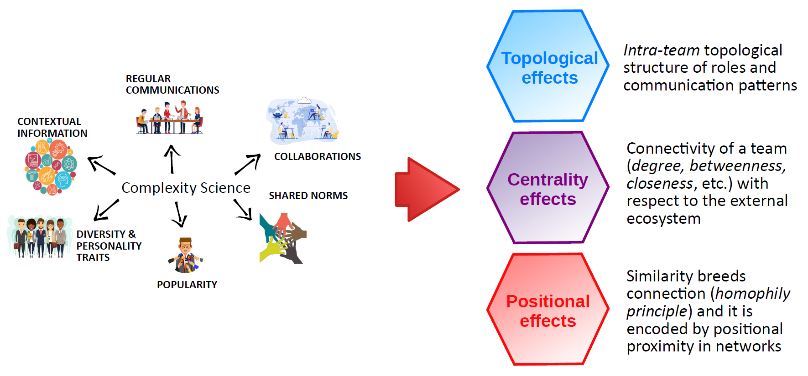
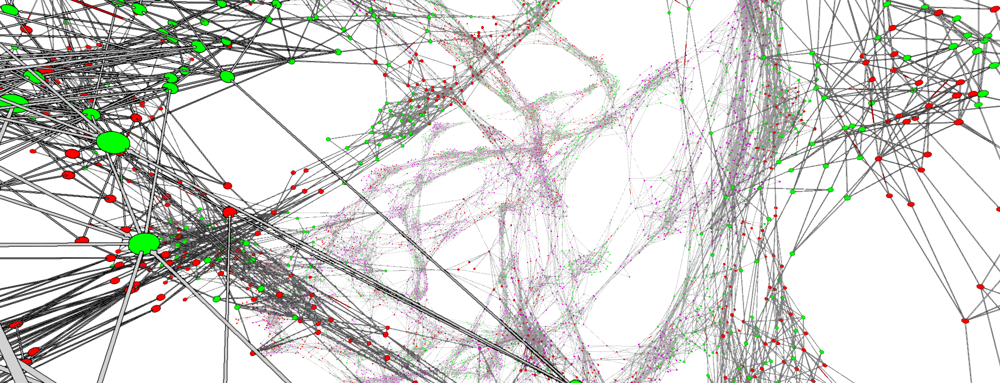
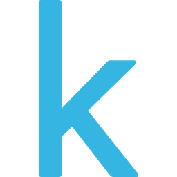
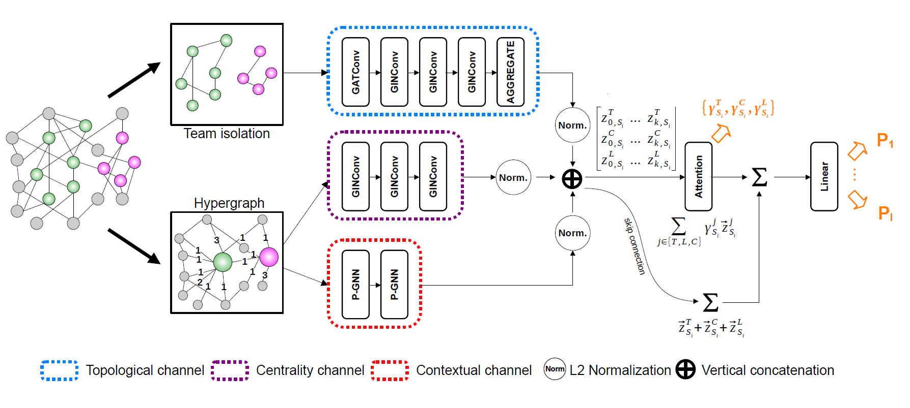

# Mentor

This is a PyTorch implementation of Mentor (📖 [Modeling Teams Performance Using Deep Representational Learning on Graphs](https://arxiv.org/abs/2206.14741))

Authors: Pietro Foini, Francesco Carli, Nicolò Gozzi, Nicola Perra, Rossano Schifanella

## How to install

### Local virtual environment

We suggest to use [PyCharm Community](https://www.jetbrains.com/pycharm/download/#section=windows) for following 
steps 2-7.

1. Install Python 3.9: Make sure you have Python installed on your system. You can download it from the official Python 
website (https://www.python.org/) and follow the installation instructions for your operating system;
2. Clone the repository;
3. Create a virtual environment;
4. Activate the virtual environment;
5. Mark `src` folder as root directory;
6. Install project dependencies: 
   1. `pip install -r requirements.txt`
7. Look in (https://download.pytorch.org/whl/torch_stable.html and https://data.pyg.org/whl/torch-1.8.0%2Bcu111.html) for 
   the torch versions you want to install (torch version, python version, CUDA version, OS etc.). Add a URL dependency 
   to your `pyproject.toml` file. For example, the current .toml file has torch 1.8.0 working with GPU on Windows system;
8. Run the commands for further project dependencies:
   1. `poetry lock --no-update`
   2. `poetry install`

Now you're all set! 🎉 Happy coding! 😄✨

-----

## Overview

### What makes a team effective? 💪

## Dataset

The datasets used are divided into two main categories: **synthetic** and **real-world** datasets. Synthetic data has been 
generated in such a way as to systematically validate the theoretical assumptions regarding the key contributions of 
the three effects: *topology*, *centrality*, and *position*. Real-world datasets, on the other hand, have been employed to 
assess the effectiveness of the models thus developed.

For more details on both types of datasets, we refer you to the respective folder where the analyses related to them have been included.

**NB:** The contextual channel described on paper refers to *positional* channel.

### Synthetic

The synthetic datasets were created to isolate the three core effects of the current methodology. They served as a 
foundation during the construction of *Mentor*, ensuring that these behaviors were effectively captured and leveraged. 
The synthetic datasets are as follows:

- **Position**: the teams' label is ruled by their position into the graph
- **Centrality**: the teams' label is ruled by the in/out degree centrality of the nodes outside the team
  - In-degree;
  - Out-degree;
- **Topology**: the teams' label is ruled by the internal connection structures of the teams
  - Topology (v1);
  - Topology (v2);
  - Topology (v3);
- **Position and Topology**: the teams' label is ruled by a combination of topological and positional effects
- **Attribute**: the teams' label is ruled by the attributes if the nodes

 

*The visualization tool used is [Graphia](https://graphia.app/).

### Real-world

Freely accessible and copyright-free data concerning team management and their respective performance are lacking. 
The three datasets we have focused on are as follows:

| [Dribbble](https://example.com/dribbble)                                  | [Kaggle](https://example.com/kaggle)                                    | [IMDb](https://example.com/imdb)                                      |
|---------------------------------------------------------------------------|-------------------------------------------------------------------------|-----------------------------------------------------------------------|
|   |   |   |

For each of these datasets, a subset was selected.

## Model

### Mentor 

We propose a graph neural network model designed to predict a team’s performance while identifying the drivers that
determine such outcome. 💡🧐

In particular, the model is based on three architectural channels: *topological*, *centrality* 
and *positional* which capture different factors potentially shaping teams’ success. We endow the model with two attention
mechanisms to boost model performance and allow interpretability. A first mechanism allows pinpointing key members 
inside the team. A second mechanism allows us to quantify the contributions of the three driver effects in determining 
the outcome performance.

## License

MIT

## Contacts

Please open an issue or contact pietro.foini1@gmail.com with any questions. 🙂