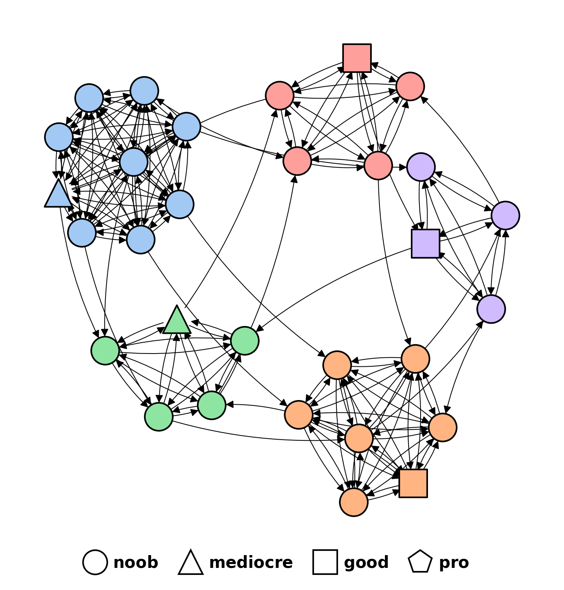

# Attributes

## Overview

We are constructing a directed graph in which team labels are determined by the attributes of a specific member within each team. The graph creation process involves several steps. Initially, we generate the desired number of nodes using the Erdos Renyi model. Subsequently, we associate each node in the network with a corresponding team. As the next step, we establish an internal structure for each team by introducing edges that form a clique among its nodes.

In the final stage, we augment the nodes with attributes that enable the differentiation of teams based on the attribute of a single node within each team. The remaining members within the team share identical attributes across all nodes in the graph. Our objective is to create a dataset with three distinct labels, thus resulting in four node types:

- *Pro*: This designation is given to a specific user exhibiting **high** levels of skill.
- *Good*: This category pertains to a particular user displaying **intermediate** levels of skill.
- *Mediocre*: Within this classification falls a specific user possessing **limited** skills.
- *Noob*: This classification encompasses common users characterized by **basic** skills.

A sample graph example:

<p align="center">
  
</p>

The colours identify the teams.

## Data

The *data* folder contains:

- ```graph.pkl```: this file contains the networkx graph you want to work with.
- ```teams_label.pkl```: this file is a dictionary where the keys are team_id and the values are the corresponding classes.
- ```nodes_name.pkl```: this file is a dictionary where the keys are node_id and the values are the corresponding unique names.
- ```nodes_attribute.pkl```: this file is a multi-index pandas dataframe (level 0 for node id and level 1 for team id) containing node attributes.

