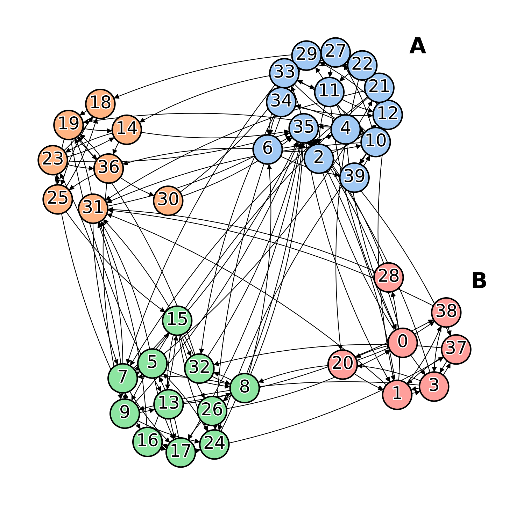
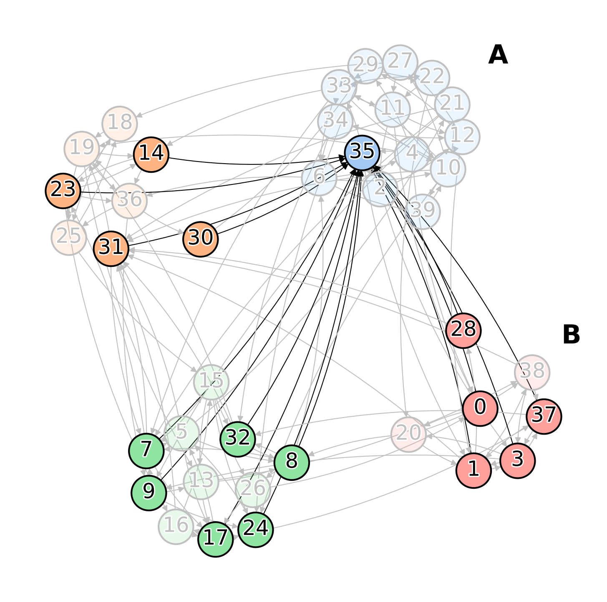
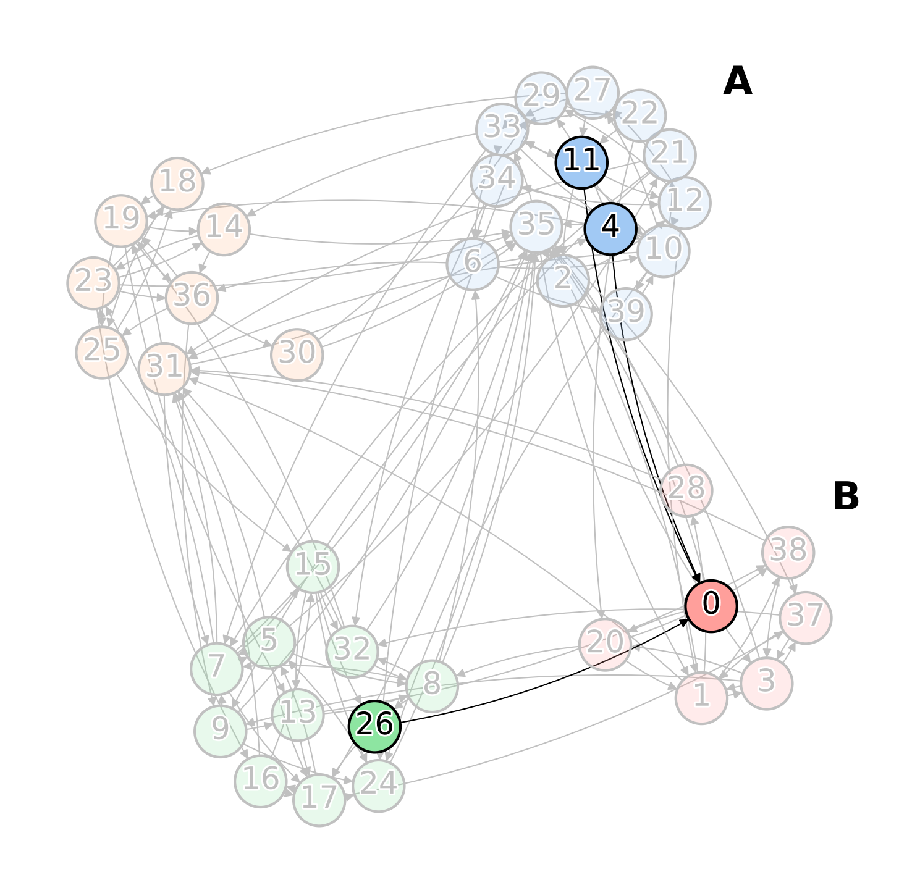

# Centrality (in-degree)

## Overview

We create a directed graph where the teams' label is driven by the value of the **in-degree** of the team respect to other teams. 

The graph is initially built defining the desired number of nodes inside the network. After that, we assign each node in the network to a corresponding team. At the end of this step, we create an internal structure (adding edges between nodes of the same team) for each team using an unique motif structure.

Finally, we add new edges into the network in order to discriminate the teams based on in-degreee. The first step is to keep `n_classes` normal distributions with different centers (distances between these centers is determined by `separation`) and split the teams into `n_classes` groups more possible equally distributed. Each team receives new edges from the outside (no same team) based on the corresponding normal distribution. The nodes of the team that receive these edges is determined by the functions (`khot`, `arithmetic`, etc.). For example, the `khot` method works connecting the new edges to k nodes of the team. In our case, we set k = 1 that it means that a single node for each team receive some edges from the outside.

Example: 

<p align="center">

</p>


The colours identify the teams.

The elected node '0' of the team 'B' for receiving edges has a small in-degree from the outside: the team will have label 0. The node '35' of the team 'A' receiving edges has an high in-degree from the outside:the team will have label 2.

<p align="center">

</p>

<p align="center">

</p>

## Data

The *data* folder contains:

- ```graph.pkl```: this file contains the networkx graph you want to work with.
- ```teams_label.pkl```: this file is a dictionary where the keys are team_id and the values are the corresponding classes.

