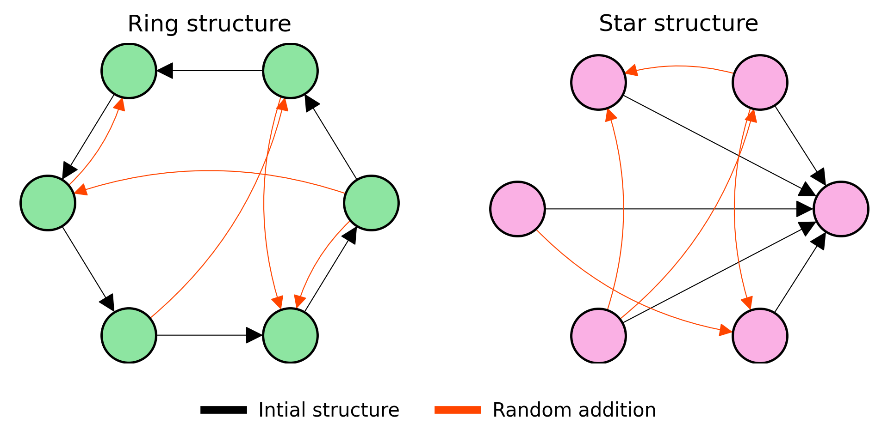

# Position & Topology

## Overview

The labels in this dataset are determined by a combination of positional and internal topological effects. 
In more depth, we come up with a scoring system that allows us to combine different metrics. *Positional effects* are 
determined by endowing each team with a pair of polar latent coordinates which map them into a 2-dimensional Euclidean 
space. Radius and angle respectively determine the magnitude and sign of the positional score. 
*Topological effects* are determined by computing the gini index of the in-degree distribution of the nodes 
inside a subgraph. Teams' internal connectivity is generated according to two different patterns (associated to low 
and high gini) and the randomly rewired. In particular, these two connectivity patterns are directed star and 
directed ring.

<p align="center">

</p>

## Data

The *data* folder contains:

- ```graph.pkl```: this file must contain the Networkx graph you want to work with.
- ```teams_label.pkl```: this file is a dictionary where the keys are team_id and the values are the corresponding classes.

