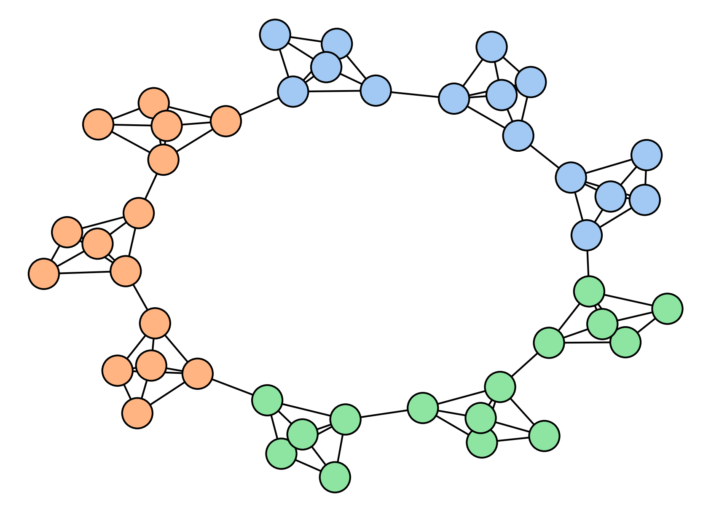

# Position

## Overview

Let's create a **connected caveman graph** composed by `n` cliques representing our teams. 
The idea is to label each team based on their position in the graph.

Example: 

<p align="center">

</p>

## Data

The *data* folder contains:

- ```graph.pkl```: this file must contain the networkx graph you want to work with.
- ```teams_label.pkl```: this file is a dictionary where the keys are team_id and the values are the corresponding classes.

